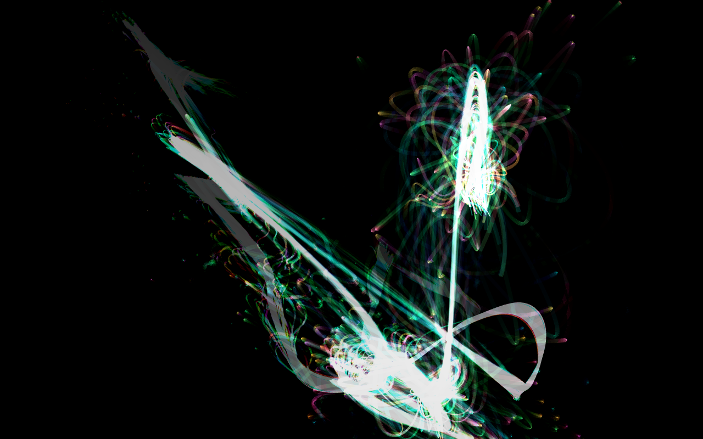
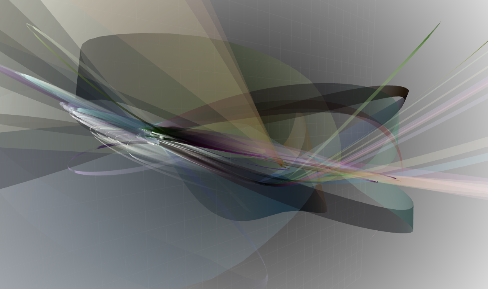
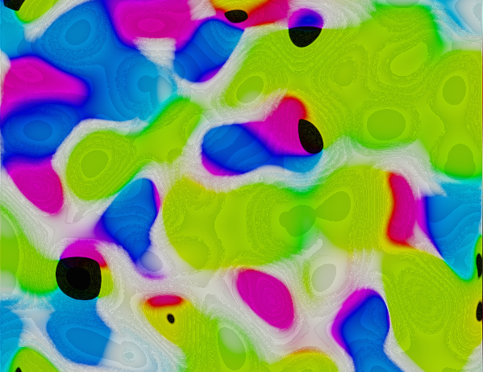
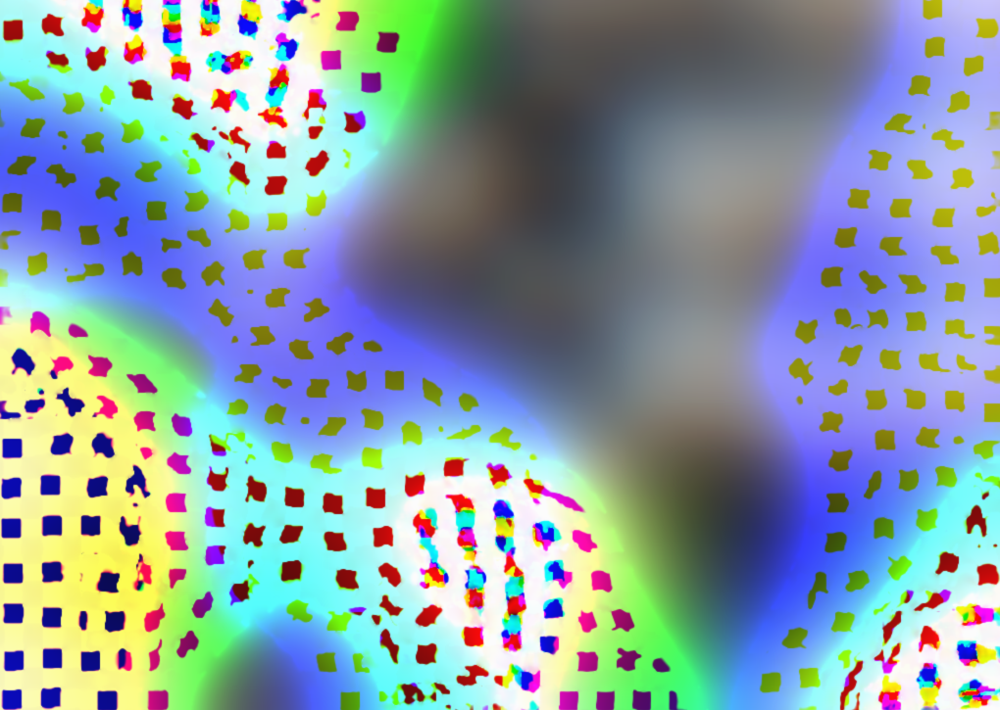
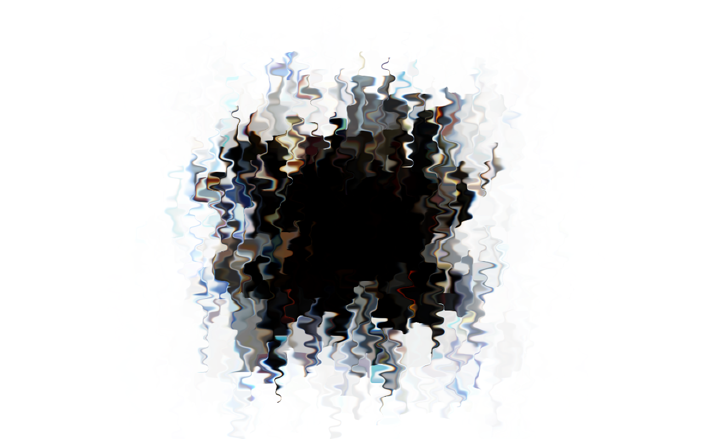
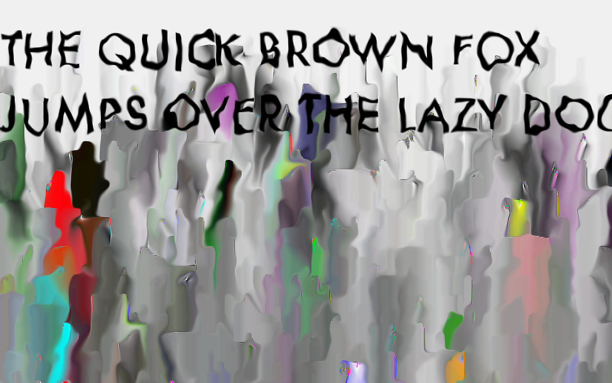
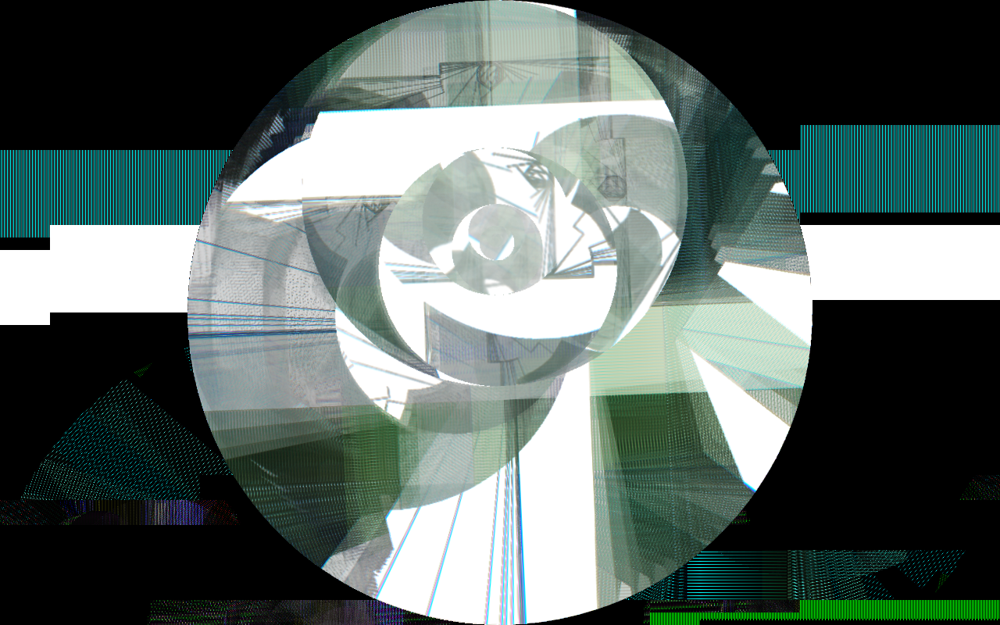
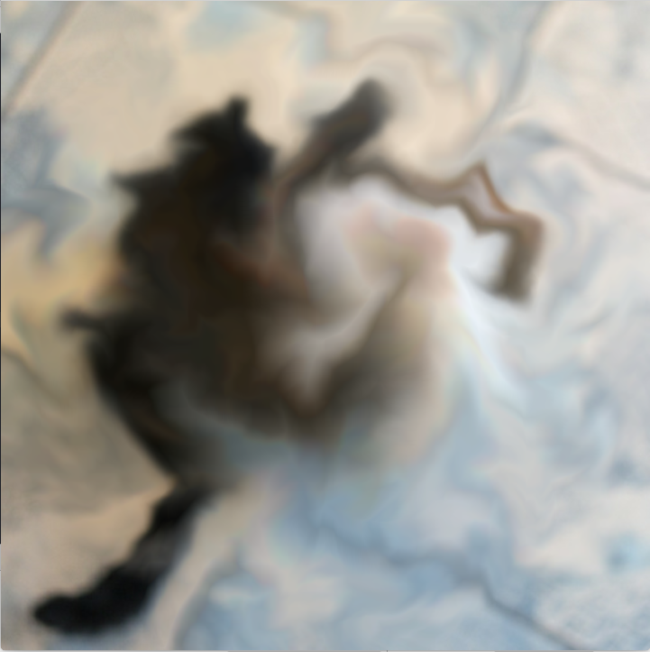

# [#tmmt_visual_sketch](https://www.instagram.com/explore/tags/tmmt_visual_sketch/)

[Tomoya Matsuura](https://matsuuratomoya.com)

This is the repository of my  almost daily sketch from Sep. 2018.

## Environment 

- Macbook Pro (13-inch, Mid 2012)
- High Sierra 10.13.5
- Xcode9.4.1
- of 0.10.0 (built from git repository)
- some of works use shader with OpenGL3/GLSL 150 mode(ofLineWidth doesn't work).

## License

Codes are MIT Lisence. Generated images(thumbnails and videos on instagram/twitter) are [CC BY-NC-SA](https://creativecommons.org/licenses/by-nc-sa/2.0/).

## Contents

### grav_ball_2d

- z/x key moves the hue of color
- space to reset  background

 

### 2_grav_ball_3D

- mouse to move a camera(ofEasyCam)
- space to accelerate particles

### 3_automaton_study

- **it is heavy, usually up to 3fps**
- any key to reset

### 4_bluranddistortion

- mouseX to amout of blur(also modulated by sine wave), mouseY to strength of pixel displacement
- z/x keys to global-strength of pixel displacement(displayed in top-left, recommend 10~20)

### 5_6_shaderfeedback - Noise/Circle displacement by noise

- f to switch fullscreen
- r to switch to circle displacement(6)
- space to switch to noise image
- mouseX to noise strength,mouseY to amount of blur

### 7shaderfeedback2 - Rectangle displacement by noise

- almost same as above
- r to switch to rectangle

### 8_character_spill

- you should link/copy futura.ttf from your ~/Library/fonts
- mouseX to noise strength
- f to switch fullscreen
- click to draw the characters again,space to reset the screen

### 9_circle_rotation

- click to reset,f to switch fullscreen(and glitch...)

### 10_circle_rotation2

- click to reset,f to fullscreen
- d to debug view
- c to switch CAT mode.
- For triple-pendulum program- I modified this code. Thanks. [https://github.com/So-Takamoto/triple_pendulums](https://github.com/So-Takamoto/triple_pendulums)

